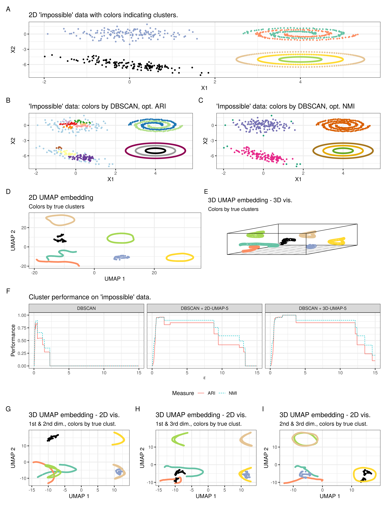

## 4.1.1 Nested sphere example

```{r spheres}
# data
sphere_dim <- 3
sphere_n <- 10000
radii <- c(5, 3, 1)
lbls_sphs <- factor(rep(1:3, each = sphere_n), labels = c("Inner", "Middle", "Outer"))

nested_spheres <- function(n, radii, d = 3) {
  sph_1 <- runif_on_sphere(n, d, r = radii[1])
  sph_2 <- runif_on_sphere(n, d, r = radii[2])
  sph_3 <- runif_on_sphere(n, d, r = radii[3])
  rbind(sph_1, sph_2, sph_3)
}

set.seed(3)
exp_sphs_dat <- nested_spheres(n = sphere_n, radii = radii, d = sphere_dim)
```

```{r spheres-plot, echo=FALSE, fig.width = 8, fig.height = 5}
# plot of nested spheres (with data cut out so nestedness becomes visible)
quad <- exp_sphs_dat[, 1] >  0 & exp_sphs_dat[, 2] < 0 & exp_sphs_dat[, 3] > 0 
ins <- seq_len(sphere_n * 3)[!(seq_len(sphere_n * 3) %in% which(quad))]
quad_1 <- sum(ins <= sphere_n)
quad_2 <- sum(ins > sphere_n & ins <= sphere_n + sphere_n)
quad_3 <- sum(ins > sphere_n + sphere_n)

scatterplot3d::scatterplot3d(
    exp_sphs_dat[!quad, ],
    pch = 1,
    highlight.3d = TRUE,
    box = FALSE,
    xlab = "",
    ylab = "",
    zlab = "")

# ggsave("vignettes/figures/sec3_nested_spheres_3D.png", device = "png", width = 8, height = 5)
```

```{r spheres-embs, eval = FALSE}
# experiments
set.seed(55)
# comp. time ~ 20 min
exp_sphs_emb7 <- umap::umap(exp_sphs_dat, n_neighbors = 7, n_components = 2)
exp_sphs_emb15 <- umap::umap(exp_sphs_dat, n_neighbors = 15, n_components = 2)
embs_sphs <- list(emb7 = exp_sphs_emb7, emb15 = exp_sphs_emb15)
# save(embs_sphs, file = "vignettes/data/embs_nested_sphs.RData")
```

```{r spheres-clust, eval=FALSE}
eps_range_sphs <- seq(0.01, 10, by = 0.01)

# ~ 4.1 h for n = 10000 & eps_range = seq(0.01, 10, by = 0.01)
cores_to_use <- 3
exp_sphs_res <- parallel::mclapply(
  list(exp_sphs_dat, exp_sphs_emb7$layout, exp_sphs_emb15$layout),
  function(dat) cluster_res(dat, eps_range = eps_range_sphs, lbls = lbls_sphs),
  mc.cores = cores_to_use
)

dt_sphs_res <- cbind(
  method = ordered(
    rep(c("DBSCAN", "DBSCAN+UMAP-7", "DBSCAN+UMAP-15"), each = length(eps_range_sphs)), 
    levels = c("DBSCAN", "DBSCAN+UMAP-7", "DBSCAN+UMAP-15")),
  eps = rep(eps_range_sphs, 3),
  as.data.table(do.call(rbind, exp_sphs_res))
)

# save(dt_sphs_res, file = "vignettes/data/res_sec3_sphs.RData")
```

```{r spheres-plt, echo=FALSE, message=FALSE, warning=FALSE}
load("data/embs_nested_sphs.RData")
load("data/results/res_sec3_sphs.RData")

exp_sphs_emb7 <- embs_sphs$emb7
exp_sphs_emb15 <-  embs_sphs$emb15
rm(embs_sphs)
gc()

dt_sphs_res_long <- melt(
  dt_sphs_res, 
  id.vars = c("method", "eps"), 
  measure.vars = c("ARI", "NMI"), 
  variable.name = "Measure", 
  value.name = "Performance"
)

spec_cols <- list(
  scale_colour_manual(
    values = c(
      scales::alpha("red", .15),
      scales::alpha("green", .15),
      scales::alpha("blue", .15)
    )
  )
)

plt_sphs_emb7 <-
  plot_emb(exp_sphs_emb7, col = lbls_sphs) +
  ggtitle("2D UMAP-7 embedding") +
  emb_lyt +
  spec_cols

plt_sphs_emb15 <- 
  plot_emb(exp_sphs_emb15, col = lbls_sphs) +
  ggtitle("2D UMAP-15 embedding") +
  emb_lyt +
  spec_cols

plt_sphs_emb7 + plt_sphs_emb15 + 
  plot_layout(guides = "collect") & theme(legend.position = "bottom")
# ggsave("vignettes/figures/sec3_nested_spheres_embs.png", device = "png", width = 8.5, height = 4.5)

ggplot(dt_sphs_res_long) +
  geom_line(aes(x = eps, y = Performance, color = Measure, lty = Measure)) +
  facet_wrap(~ method, scales = "free_x", ncol = 3) +
  xlab(eps_tex) +
  ylim(0, 1) +
  theme(legend.position = "bottom")

# ggsave("vignettes/figures/sec3_nested_spheres_clust.png", device = "png", width = 8.5, height = 4.5)
```

## 4.1.2 Impossible data

```{r app2-data}
# Data

# construction of impossible data
set.seed(5)
sprls <- mlbench.spirals(300, 1.5, 0.03) 
sprls$x[, 1] <- sprls$x[, 1] + 4
norm1 <- MASS::mvrnorm(n = 150, mu = c(0, 0), matrix(c(0.5, 0, 0, 0.5), nrow = 2))
norm2 <- MASS::mvrnorm(n = 150, mu = c(0, -6), matrix(c(0.5, -0.4, 0, 0.5), nrow = 2))

circleFun <- function(center = c(0,0), diameter = 1, npoints = 150){
  r = diameter / 2
  tt <- seq(0, 2 * pi, length.out = npoints)
  xx <- center[1] + r * cos(tt)
  yy <- center[2] + r * sin(tt)
  return(data.frame(x = xx, y = yy))
}

circles <- lapply(c(1, 2, 3), function(r) circleFun(c(4, -5), r))
imp_dat <- as.data.frame(rbind(sprls$x, norm1, norm2))
names(imp_dat) <- c("x", "y")
imp_dat <- do.call(rbind, c(list(imp_dat), circles))
imp_lbls <- factor(c(sprls$classes, rep(c(3, 4, 5, 6, 7), each = 150)))
```

```{r app2-clust}

umap_2d <- umap::umap(imp_dat, n_neighbors = 5, n_components = 2)
umap_3d <- umap::umap(imp_dat, n_neighbors = 5, n_components = 3)

eps_range_imp <- seq(0.01, 15, by = 0.01)

# computation time ~ 1 min
cores_to_use <- 3
exp_res_imp <- parallel::mclapply(
  list(imp_dat, umap_2d$layout, umap_3d$layout),
  function(dat) cluster_res(dat, eps_range = eps_range_imp, lbls = imp_lbls),
  mc.cores = cores_to_use 
)

opt_eps <- sapply(exp_res_imp, function(x) apply(x, 2, which.max))

opt_dbs_clusts <- lapply(opt_eps[, 1], function(x) dbscan(imp_dat, eps = eps_range_imp[x]))
opt_umap_clusts <- mapply(
  function(dat, eps) dbscan(dat, eps = eps_range_imp[eps]),
  eps = opt_eps[1, 2:3],
  dat = list(umap_2d$layout, umap_3d$layout)
)
```

```{r app2-plots, echo=FALSE, eval=FALSE}
dt_res_imp <- cbind(
  method = ordered(
    rep(c("DBSCAN", "DBSCAN + 2D-UMAP-5", "DBSCAN + 3D-UMAP-5"), 
        each = length(eps_range_imp)),
    levels = c("DBSCAN", "DBSCAN + 2D-UMAP-5", "DBSCAN + 3D-UMAP-5")
  ),
  eps = rep(eps_range_imp, 3),
  as.data.table(do.call(rbind, exp_res_imp))
)

dt_res_imp_long <- melt(
  dt_res_imp, 
  id.vars = c("method", "eps"), 
  measure.vars = c("ARI", "NMI"), 
  variable.name = "Measure", 
  value.name = "Performance"
)

plt_clust_res <- 
  ggplot(dt_res_imp_long) +
    geom_line(aes(x = eps, y = Performance, color = Measure, lty = Measure)) +
    facet_wrap(~ method, scales = "free_x", ncol = 3) +
    xlab(eps_tex) +
    ylim(0, 1) +
    ggtitle("Cluster performance on 'impossible' data.") +
    theme(legend.position = "bottom")

# data/embeddings with clusters of opt eps val
opt_eps <- sapply(exp_res_imp, function(x) apply(x, 2, which.max))

opt_dbs_clusts <- lapply(opt_eps[, 1], function(x) dbscan(imp_dat, eps = eps_range_imp[x]))
opt_umap_clusts <- mapply(
  function(dat, eps) dbscan(dat, eps = eps_range_imp[eps]),
  eps = opt_eps[1, 2:3],
  dat = list(umap2d = umap_2d$layout, umap3d = umap_3d$layout),
  SIMPLIFY = FALSE
)

cols_lbls <- RColorBrewer::brewer.pal(7, "Set2")
cols_lbls[cols_lbls == "#E78AC3"] <- "#000000"
cols_dbsNMI <- RColorBrewer::brewer.pal(7, "Dark2")
cols_dbsARI <- c(RColorBrewer::brewer.pal(12, "Paired"), "#000000", "#999999", "#8E0152")

# Data (colored by true clusters)
plt_imp_dat <- plot_emb(imp_dat, imp_lbls) +
  xlab("X1") +
  ylab("X2") +
  ggtitle("2D 'impossible' data with colors indicating clusters.")  +
  scale_color_manual(values = cols_lbls)

## Data colored by DBSCAN cluster results
plt_dbs_ARI <- plot_emb(imp_dat, color = factor(opt_dbs_clusts$ARI$cluster)) +
  xlab("X1") +
  ylab("X2") +
  ggtitle("'Impossible' data: colors by DBSCAN, opt. ARI")  +
  scale_color_manual(values = cols_dbsARI)
plt_dbs_NMI <- plot_emb(imp_dat, color = factor(opt_dbs_clusts$NMI$cluster)) +
  xlab("X1") +
  ylab("X2") +
  ggtitle("'Impossible' data: colors by DBSCAN, opt. NMI") +
  scale_color_manual(values = cols_dbsNMI)
plt_dbs <- plt_dbs_ARI + plt_dbs_NMI

# 2D embedding (colored by true clusters)
plt_umap_2d <- plot_emb(umap_2d$layout, imp_lbls) +
  xlab("UMAP 1") +
  ylab("UMAP 2") +
  ggtitle("2D UMAP embedding", subtitle = "Colors by true clusters") +
  scale_color_manual(values = cols_lbls)

# 3D embedding (colored by true clusters)
## 2D vis
dim_combs = list("1st & 2nd" = 1:2, "1st & 3rd" = c(1, 3), "2nd & 3rd" = 2:3)
  
plt_umap_3d_2d <- lapply(
  seq_along(dim_combs),
  function(i) {
    dims <- dim_combs[[i]]
    nams <- names(dim_combs)[i]
    
    plot_emb(umap_3d$layout[, dims], imp_lbls) +
      xlab("UMAP 1") +
      ylab("UMAP 2") +
      ggtitle("3D UMAP embedding - 2D vis.", subtitle = paste0(nams, " dim., colors by true clust.")) +
      scale_color_manual(values = cols_lbls)
  } 
)  
## 3D vis
scatterplot3d::scatterplot3d(umap_3d$layout, color = factor(imp_lbls, labels = cols_lbls), tick.marks = FALSE, 
                             xlab = "", ylab = "", zlab = "")
gridGraphics::grid.echo()
plt_umap_3d <- grid::grid.grab()
plt_umap_3d <- ggplotify::as.ggplot(plt_umap_3d) + ggtitle("3D UMAP embedding - 3D vis.", subtitle = "Colors by true clusters")
 
plt_imp_dat / plt_dbs / (plt_umap_2d + plt_umap_3d) / plt_clust_res / wrap_plots(plt_umap_3d_2d) + 
  plot_annotation(tag_levels = "A")
# ggsave("vignettes/figures/app2_impdata.png", device = "png", width = 11.5, height = 15)
```

<!-- The figure is loaded since binding a base plot to a variable as is done above does not lead to a nice rmd output -->




## 4.2 Outlier and noise points

```{r outs-and-noise}
# data setup

p <- 2
n <- 500
means <- list(c(0, 2), c(4, 2))
sig <- diag(rep(0.1, p * p), p, p)


# outlier

set.seed(2)
exp_outs_dat <- do.call(
  rbind, 
  lapply(means, function(mu) mvrnorm(n = n, mu = mu, Sigma = sig))
)
exp_outs_emb <- umap::umap(exp_outs_dat, n_neighbors = 15, random_state = 2)

outs <- exp_outs_dat[, 2] < 1 | (exp_outs_dat[, 2] > 2.75 & exp_outs_dat[, 1] < 0)
lbls_outs <- rep(1:2, each = n)
lbls_outs[outs] <- 3
lbls_outs <- factor(lbls_outs, levels = c(1, 2, 3, 4),
                    labels = c("Cluster1", "Cluster2", "Outlier", "Noise"))


# noise

set.seed(4015)
noise <- cbind(runif(100, -1, 5),  runif(100, 1, 3))
exp_noisy_dat <- rbind(exp_outs_dat, noise)
lbls_noise <- c(lbls_outs, factor(rep("Noise", 100)))
exp_noise_emb <- umap::umap(exp_noisy_dat, n_neighbors = 15, random_state = 2)
```

```{r outs-and-noise-plots, echo=FALSE, fig.width = 9, fig.height = 5.5}
plt_outs <-
  plot_emb(exp_outs_dat, col = lbls_outs) +
  ggtitle("2D data with outliers") +
  dat_lyt

plt_outs_emb <-
  plot_emb(exp_outs_emb, col = lbls_outs) +
  ggtitle("2D UMAP-15: outliers") +
  emb_lyt

plt_noise <- 
  plot_emb(exp_noisy_dat, col = lbls_noise) +
  ggtitle("2D data with noise/outliers") +
  dat_lyt +
  theme(legend.position = "bottom") 

plt_noise_emb <-
  plot_emb(exp_noise_emb, col = lbls_noise) +
  ggtitle("2D UMAP-15: noise/outliers") +
  emb_lyt +
  theme(legend.position = "bottom")

(plt_outs + plt_outs_emb) / 
  (plt_noise + plt_noise_emb + plot_layout(guides = "collect") & theme(legend.position = "bottom")) +
  plot_annotation(tag_levels = "A")

# ggsave("vignettes/figures/sec3_plts_outs.png", device = "png", width = 9, height = 5.5)
```

## 4.3 Connected components

```{r connected-comps}
# data setup

p <- 2
n <- 500
means <- list(
  c(0, 2),
  c(2, 2)
)

# cc: bridged

sig_bridge <- diag(rep(0.1, p * p), p, p)

set.seed(2)
clusters <- do.call(
  rbind, 
  lapply(means, function(mu) mvrnorm(n = n, mu = mu, Sigma = sig_bridge))
)
bridge <- cbind(runif(10, 0.85, 1.15), runif(10, 1.85, 2.15))
exp_bridge_dat <- rbind(clusters, bridge)

exp_bridge_embs <- lapply(
  c(k15 = 15, k505 = 505),
  function(k) umap::umap(exp_bridge_dat, n_neighbors = k, random_state = 331)
)

lbls_bridge <- factor(
  c(rep(1:2, each = n), rep(3, 10)), 
  labels = c("Cluster1", "Cluster2", "Bridge")
)


# cc: overlap

sig_overlap <- diag(rep(1, p * p), p, p)
set.seed(2)
exp_overlap_dat <- do.call(
  rbind, 
  lapply(means, function(mu) mvrnorm(n = n, mu = mu, Sigma = sig_overlap))
)

exp_overlap_embs <- lapply(
  c(k15 = 15, k505 = 505),
  function(k) umap::umap(exp_overlap_dat, n_neighbors = k, random_state = 332)
)

lbls_overlap <- factor(c(rep(1:2, each = n)), labels = c("Cluster1", "Cluster2"))

```

```{r connect-comps-plots, echo=FALSE, fig.width = 10, fig.height = 8}
plt_brdg <-
  plot_emb(exp_bridge_dat, col = lbls_bridge) +
  ggtitle("2D data with bridged clusters") +
  dat_lyt

plt_brdg_embs <- lapply(
  exp_bridge_embs,
  function(emb) plot_emb(emb, col = lbls_bridge) + emb_lyt)

plts_brdg <-  
  plt_brdg + 
  ((plt_brdg_embs[[1]] + ggtitle("2D UMAP-15 emb.")) +
  (plt_brdg_embs[[2]] + ggtitle("2D UMAP-505 emb."))) +
  plot_layout(guides = "collect") & theme(legend.position = "bottom")

plt_overlap <-
  plot_emb(exp_overlap_dat, col = lbls_overlap) +
  ggtitle("2D data with strongly overlapping clusters") +
  dat_lyt

plt_overlap_embs <- lapply(
  exp_overlap_embs,
  function(emb) plot_emb(emb, col = lbls_overlap) + emb_lyt)

plts_overlap <-  
  plt_overlap + 
  ((plt_overlap_embs[[1]] + ggtitle("2D UMAP-15 emb.")) +
  (plt_overlap_embs[[2]] + ggtitle("2D UMAP-505 emb."))) +
  plot_layout(guides = "collect") & theme(legend.position = "bottom")


plts_brdg / plts_overlap + plot_annotation(tag_levels = "A")
# ggsave("vignettes/figures/sec3_connected.png", device = "png", width = 10, height = 8)
```

## 4.4 FCPS data

```{r fcps, eval=FALSE}

## settings

# UMAP 
k <- 10
rand_state <- 10

# DBSCAN
eps_range_fcps <- seq(0.01, 20, by = 0.01)


## data

datsets <- c("Hepta", "Lsun", "Tetra", "Chainlink", "Atom", 
             "EngyTime", "Target", "TwoDiamonds", "WingNut", "GolfBall")

exp_fcps_dats <- sapply(
  datsets,
  function(dat) {
     d <- read.table(paste0("data/FCPS/01FCPSdata/", dat, ".txt"))
     d <- d[, -1] # remove useless index column
     names(d) <- paste0("X", seq_len(ncol(d)))
     d
  }
)

lbls_fcps <- sapply(
  datsets,
  function(dat) {
    lbls <- read.table(paste0("data/FCPS/01FCPSdata/", dat, "_lbls.txt"))
    as.factor(lbls$V2)
  }
)


## embeddings 

exp_fcps_embs <- lapply(
  exp_fcps_dats,
  function(dat) umap::umap(dat, n_neighbors = k, random_state = rand_state)
)


## clustering

# comp time: ~ 20 m
cores_to_use <- 5
exp_fcps_res <- parallel::mcmapply(
  function(dat, lbls) cluster_res(
    dat = dat, 
    eps_range = eps_range_fcps, 
    lbls = lbls_fcps[[lbls]]
  ),
  dat = c(exp_fcps_dats, lapply(exp_fcps_embs, function(emb) emb$layout)),
  lbls = rep(datsets, 2),
  SIMPLIFY = FALSE,
  mc.cores = cores_to_use
)

## results

dt_fcps_res <- cbind(
  method = factor(rep(c("DBSCAN", "DBSCAN+UMAP-10"), 
                      each = length(names(exp_fcps_dats)) * length(eps_range_fcps))),
  data = rep(names(exp_fcps_res), each = length(eps_range_fcps)),
  eps = rep(eps_range_fcps, length(names(exp_fcps_res))),
  as.data.table(do.call(rbind, exp_fcps_res))
)

# save(dt_fcps_res, file = "vignettes/data/res_sec3_fcps.RData")
```

```{r fcps-res}
load("data/results/res_sec3_fcps.RData")

eps_threshold <- 0

dt_fcps_res[, .(maxARI = round(max(ARI), 2), 
                maxNMI = round(max(NMI), 2)), 
            by = c("data", "method")]
dt_fcps_res[, .(eps_range_gr = range(eps[ARI > eps_threshold])), 
            by = c("data", "method")]
```

